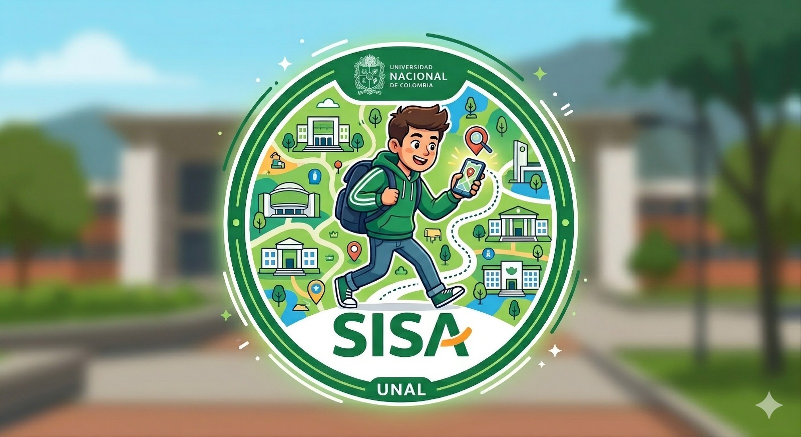

# 🎓 SISA – Sistema de Supervivencia Académica

## 👥 Nombre del grupo
**Programangos**

## 👨‍💻 Integrantes y 📩 Contacto
- Carlos Daniel Albarracín Cruz  : caalbarracin@unal.edu.co  
- Pablo Andrés Pérez Beltrán  : pbeltran@unal.edu.co  
- David Nickolai Parra Ariza : dparraar@unal.edu.co  
- Jhoan Sebastián Yaya García : jyayag@unal.edu.co

---

## 📌 Descripción del Proyecto

SISA (Sistema de Supervivencia Académica) es una página web colaborativa orientada inicialmente a estudiantes de ingeniería, cuyo propósito es centralizar información relevante sobre trámites administrativos, edificios del campus, eventos, avisos y consejos universitarios.

A diferencia de los portales institucionales tradicionales, SISA no se enfoca principalmente en información académica como horarios o contenidos, sino en los **trámites administrativos y la experiencia real del estudiante al gestionarlos**, así como en la difusión de avisos relevantes para la comunidad universitaria.

El sistema incorpora un modelo colaborativo basado en experiencias reales, permitiendo calcular métricas como tiempos promedio de trámites, implementar un sistema de recompensas con títulos y reconocimientos personalizados, y fomentar la participación activa. Además, integra un **mapa interactivo del campus**, donde los estudiantes pueden consultar información contextualizada de los edificios.

---

## 🖼 Logo del Proyecto

